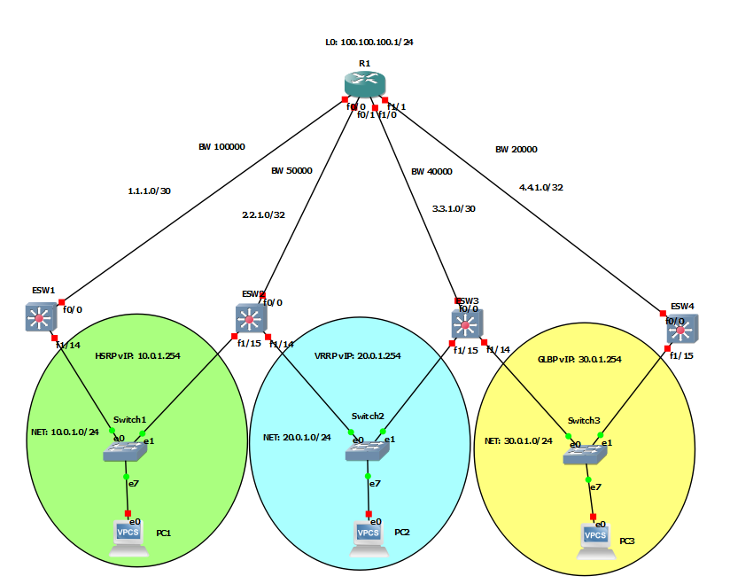

# Practica 1
## Intro
### Network Diagram


> The "X" represents the team number at the third octect

### FHRP Configs
| RP     | Maestro/Activo/AVG | Prioridad Maestro/Activo | VIP        | Preempt     | Interfase a trackear      | Timers          | Grupo |
| ------ | ------------------ | ------------------------ | ---------- | ----------- | ------------------------- | --------------- | ----- |
| HSRPv2 | ESW1               | 110                      | 10.0.1.254 | ESW1 / ESW2 | F0/0 en ESW1              | Hello 1, Hold 4 | 11    |
| VRRP   | ESW2               | 110                      | 20.0.1.254 | ESW2 / ESW3 | F0/0 en ESW2              | Default         | 11    |
| GLBP   | ESW3               | 110                      | 30.0.1.254 | ESW3 / ESW4 | Para GLBP no es necesario | Defualt         | 11    |

### IP assignment
| Device | Interface | IP            | Mask            | Gateway    | vIP        |
| ------ | --------- | ------------- | --------------- | ---------- | ---------- |
| R1     | F0/0      | 1.1.1.1       | 255.255.255.252 | NA         | NA         |
|        | F0/1      | 2.2.1.1       | 255.255.255.252 | NA         | NA         |
|        | F1/0      | 3.3.1.1       | 255.255.255.252 | NA         | NA         |
|        | F1/1      | 4.4.1.1       | 255.255.255.252 | NA         | NA         |
|        | L0        | 100.100.100.1 | 255.255.255.0   | NA         | NA         |
| ESW1   | F0/0      | 1.1.1.2       | 255.255.255.252 | NA         | NA         |
|        | F1/14     | 10.0.1.1      | 255.255.255.0   | NA         | 10.0.1.254 |
| ESW2   | F0/0      | 2.2.1.2       | 255.255.255.252 | NA         | NA         |
|        | F1/14     | 20.0.1.1      | 255.255.255.0   | NA         | 20.0.1.254 |
|        | F1/15     | 10.0.1.2      | 255.255.255.0   | NA         | 10.0.1.254 |
| ESW3   | F0/0      | 3.3.1.2       | 255.255.255.252 | NA         | NA         |
|        | F1/14     | 30.0.1.1      | 255.255.255.0   | NA         | 30.0.1.254 |
|        | F1/15     | 20.0.1.2      | 255.255.255.0   | NA         | 20.0.1.254 |
| ESW4   | F0/0      | 4.4.1.2       | 255.255.255.252 | NA         | NA         |
|        | F1/15     | 30.0.1.2      | 255.255.255.0   | NA         | 30.0.1.254 |
| PC1    | E0        | 10.0.1.10     | 255.255.255.0   | 10.0.1.254 | NA         |
| PC2    | E0        | 20.0.1.10     | 255.255.255.0   | 20.0.1.254 | NA         |
| PC3    | E0        | 30.0.1.10     | 255.255.255.0   | 30.0.1.254 | NA         |

## How To
### Config vPCs
Sintaxis:
```shell
ip [ip_address]/[mask] [gateway]
```

Example:
```shell
ip 192.168.0.10/24 192.168.0.1
```

### Config IP (ESW and R1)
```
conf t
int [Interface]
no switchport           # Only if this is part of a 16 ports expansion
ip address [IP] [MASK]
no shutdown
```

### Config EIGRP (ESW and R1)
EIGRP
```
router eigrp 11
network [IP address] [Wildcard Mask]
no auto-summary
```
> Repeat for every active interface

### Config Max BW for interfaces ESW <-> R1
```
interface [Int]
bandwidth [1-10000000]
```

### Config ESW Masters - HSRP
```
interface [Int]
standby 11 priority 110
```

### Config ESW Masters - VRRP
```
interface [Int]
vrrp 11 priority 110
```

### Config ESW Masters - GLBP
```
interface [Int]
glbp 11 priority 110
```

### Config ESW
HSRP
```
interface [Int]
standby version 2
standby 11 ip [vIP]
standby 11 timers 1 4
standby 11 preempt
standby 11 track [Int to R1]
```

VRRP
```
interface [Int]
vrrp 11 ip [vIP]
vrrp 11 preempt
```

GLBP
```
interface [Int]
glbp 11 ip [vIP]
glbp 11 preempt
```

### Config Loopback 0 on R1
```
interface loopback 0
ip add [IP] [MASK]
```