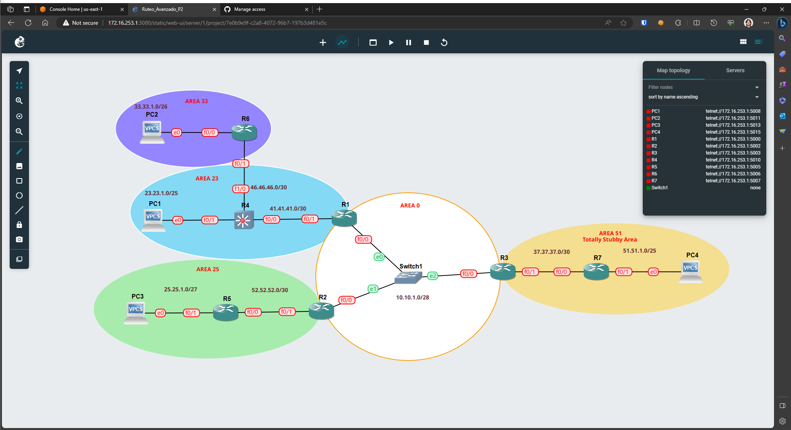

# Practica 2
## Intro
### Network Diagram


### IP assignment
| Device | Interface | IP          | Mask            | CIDR | Gateway     | OSPF Area | OSPF RID |
| ------ | --------- | ----------- | --------------- | ---- | ----------- | --------- | -------- |
| R1     | f0/0      | 10.10.1.1   | 255.255.255.240 | /28  | NA          | 0         | 1.1.1.1  |
|        | f0/1      | 41.41.41.1  | 255.255.255.252 | /30  | NA          | 23        |          |
|        | l0        | 1.1.1.1     | 255.255.255.255 | /32  | NA          | 23        |          |
| R2     | f0/0      | 10.10.1.2   | 255.255.255.240 | /28  | NA          | 0         | 2.2.2.2  |
|        | f0/1      | 52.52.52.1  | 255.255.255.252 | /30  | NA          | 25        |          |
|        | l0        | 2.2.2.2     | 255.255.255.255 | /32  | NA          | NA        |          |
| R3     | f0/0      | 10.10.1.3   | 255.255.255.240 | /28  | NA          | 0         | 3.3.3.3  |
|        | f0/1      | 37.37.37.1  | 255.255.255.252 | /30  | NA          | 51        |          |
|        | l0        | 3.3.3.3     | 255.255.255.255 | /32  | NA          | NA        |          |
| R4     | f0/0      | 41.41.41.1  | 255.255.255.252 | /30  | NA          | 23        | 4.4.4.4  |
|        | f0/1      | 23.23.1.126 | 255.255.255.128 | /25  | NA          | 23        |          |
|        | f1/0      | 46.46.46.1  | 255.255.255.252 | /30  | NA          | 23        |          |
|        | l0        | 4.4.4.4     | 255.255.255.255 | /32  | NA          | NA        |          |
| R5     | f0/0      | 52.52.52.2  | 255.255.255.252 | /30  | NA          | 25        | 5.5.5.5  |
|        | f0/1      | 25.25.1.30  | 255.255.255.224 | /27  | NA          | 25        |          |
|        | l0        | 5.5.5.5     | 255.255.255.255 | /32  | NA          | NA        |          |
| R6     | f0/0      | 33.33.1.62  | 255.255.255.192 | /26  | NA          | 33        | 6.6.6.6  |
|        | f0/1      | 46.46.46.2  | 255.255.255.252 | /30  | NA          | 23        |          |
|        | l0        | 6.6.6.6     | 255.255.255.255 | /32  | NA          | 23        |          |
| R7     | f0/0      | 37.37.37.2  | 255.255.255.252 | /30  | NA          | 51        | 7.7.7.7  |
|        | f0/1      | 51.51.1.126 | 255.255.255.128 | /25  | NA          | 51        |          |
|        | l0        | 7.7.7.7     | 255.255.255.255 | /32  | NA          | NA        |          |
| PC1    | e0        | 23.23.1.1   | 255.255.255.128 | /25  | 23.23.1.126 | NA        | NA       |
| PC2    | e0        | 33.33.1.1   | 255.255.255.192 | /26  | 33.33.1.62  | NA        | NA       |
| PC3    | e0        | 25.25.1.1   | 255.255.255.224 | /27  | 25.25.1.30  | NA        | NA       |
| PC4    | e0        | 51.51.1.1   | 255.255.255.128 | /25  | 51.51.1.126 | NA        | NA       |

## How To
### Config vPCs
Sintaxis:
```shell
ip [ip_address]/[mask] [gateway]
```

Example:
```shell
ip 192.168.0.10/24 192.168.0.1
```

### Config Routers IP
```
conf t
int [Interface]
no switchport           # Only if this is part of a 16 ports expansion (Multilayer SW)
ip address [IP] [MASK]
no shutdown
```

### Config OSPF Totally Stubby Area
```
router ospf 100
area [Area number] stub no-summary
```

### Config OSPF Virtual Links
```
router ospf 100
area [Area number] virtual-link [RID]
```

### Config BDR/DR
```
int [interface]
ip ospf priority [0-255]
```

> Note: Default priority (0-255) is 1; highest priority wins; 0 cannot be elected

### Config OSPF area
```
int [interface]
ip ospf 100 area [Area number]
```

### Config OSPF Area 0
```
router ospf 100
redistribute static subnets
network 10.10.1.0 0.0.0.15 area 0
```

### Config Loopback 0
```
interface loopback 0
ip add [IP/RID] [MASK]
```

### Config RID
```
router-id [RID]
```